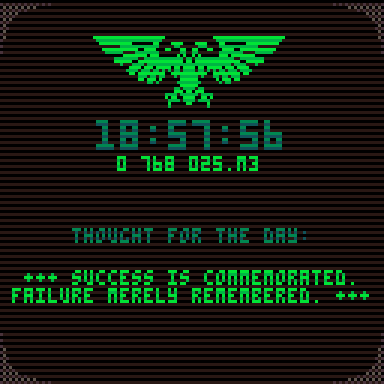
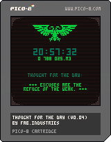

# PICO-8 Thought for the Day

A small PICO-8 app that displays the current time and [Imperial date](https://wh40k.lexicanum.com/wiki/Imperial_Dating_System#Old_Style_.28Pre-Great_Rift.29), along with an inspirational quote from your local Departmento Munitorum's [Commissariat](https://wh40k.lexicanum.com/wiki/Commissariat) office.

This is based on my earlier web version for [munitorum.net](https://munitorum.net).

### Download PICO-8 Cartridge

### Thanks

Many thanks to the following people whose code I used as part of my program:

* [Glitch effect](https://gist.github.com/morningtoast/18a2f24a0706226e8762116b801303c4) by [**morningtoast**](https://github.com/morningtoast)
* [Scanline effect](https://www.lexaloffle.com/bbs/?pid=148980#p) by [**freds72**](https://www.lexaloffle.com/bbs/?uid=25532)

### Changelog

**v0.03** (15/10/2025): Added proverbs, minor improvements  
**v0.02** (11/10/2025): Improved Imperial date calculation algorithm  
**v0.01** (08/10/2025): Initial release
