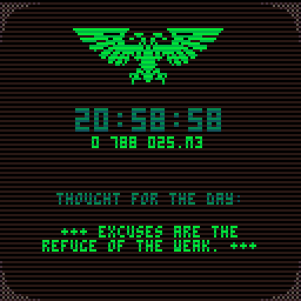

# Thought for the Day

A small app that displays the current time of day (in 24-hour format), the current [Imperial date from _Warhammer 40,000_](https://wh40k.lexicanum.com/wiki/Imperial_Dating_System) and an inspirational quote from your  local [Departmento Munitorum's Commissariat](https://wh40k.lexicanum.com/wiki/Commissariat) office. It was written for the [PICO-8](https://www.lexaloffle.com/pico-8.php) fantasy console, but can also be used standalone.

Thought for the Day is brought to you by [_**FAB INDUSTRIES**_](https://fab.industries).

## Download

This app is available as a cartridge for the PICO-8 fantasy console and as standalone binaries for Windows, 64-bit Linux, Mac OS X and the Raspberry Pi.

* [PICO-8 cartridge](https://github.com/fab-industries/tftd/releases/download/v0.06/tftd.p8.png)
* [Windows](https://github.com/fab-industries/tftd/releases/download/v0.06/tftd_windows.zip)
* [Linux](https://github.com/fab-industries/tftd/releases/download/v0.06/tftd_linux.zip)
* [MacOS X](https://github.com/fab-industries/tftd/releases/download/v0.06/tftd_osx.zip)
* [Raspberry Pi](https://github.com/fab-industries/tftd/releases/download/v0.06/tftd_raspi.zip)

## Web Version

There is also a [web version](https://fab.industries/pico-8/tftd/) that should work on most desktop and mobile browsers.

---

## Development

The source code is licensed under the [MIT License](https://github.com/fab-industries/tftd/blob/master/LICENSE) and can be viewed [on GitHub](https://github.com/fab-industries/tftd). Improvements are welcome! Please [contact me](https://fab.industries/about/#contact) if you have suggestions.

### Changelog

#### v0.06 - 02/11/2025

* Fixed a bug that prevented the web version of the app from running correctly
* Fixed a typo in a thought

#### v0.05 - 02/11/2025

* App now runs at 60 FPS
* Improved digital effects
* Released standalone and web versions

#### v0.04 - 19/10/2025
* Fixed crash when running from the BBS on an iPhone

#### v0.03 - 15/10/2025

* Added proverbs, minor improvements
#### v0.02 - 11/10/2025

* Improved Imperial date calculation algorithm
#### v0.01 - 08/10/2025

* Initial release